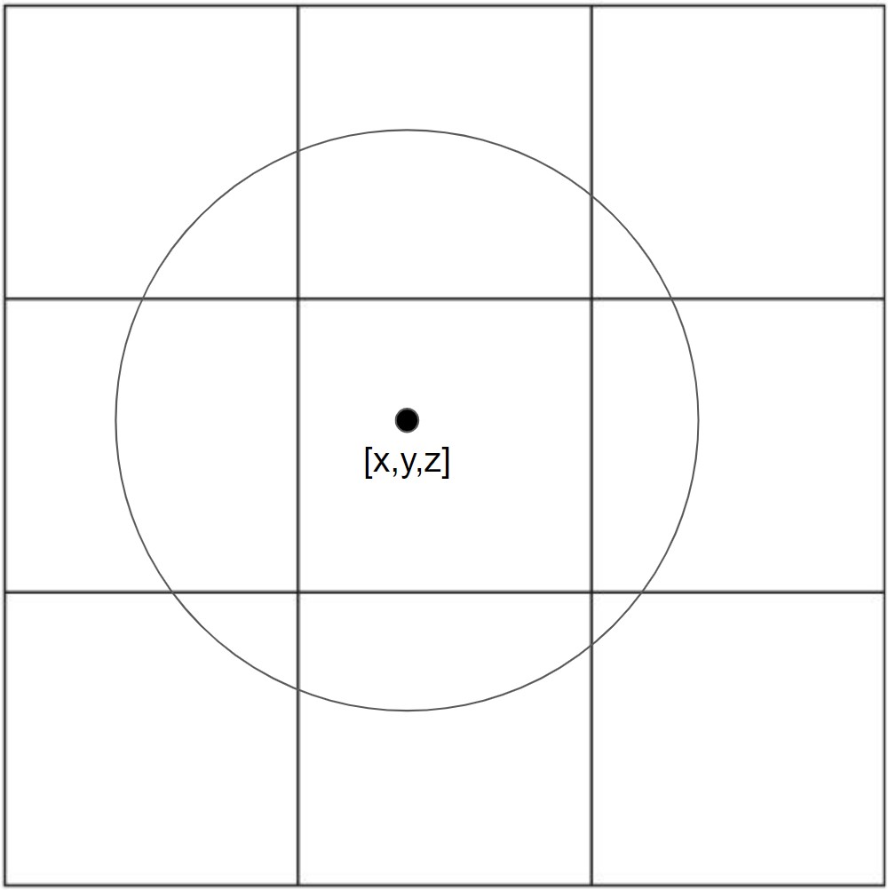

Solution for Student challenge particle simulation
=====================================

Algorithm
----------

The first step of the solution is categorizing all individual points. 
We can sort these points by turning the continuous 3D-room into a discrete one.
By dividing the space into cubes with side length $d = 0.05$ m, the search is limited to the,
at most, 27 nearest surrounding cubes. A two-dimesional cross-section is shown below. 
The radius of the circle is the distance d.

For example, the point [0.01, 0.02, 0.03] should be in the cube with indices (0,0,0). 
Mathematically this corresponds to the floor division operator. Now we can iterate over each point
to check the distance to all points in the closest 27 cubes, and remove that point to avoid double-counting.